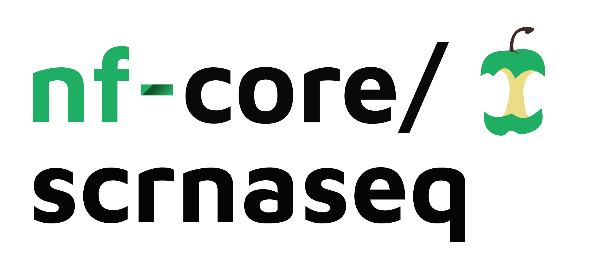
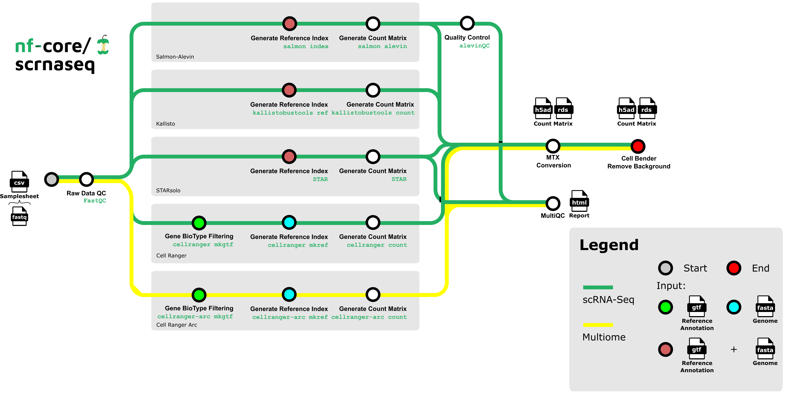
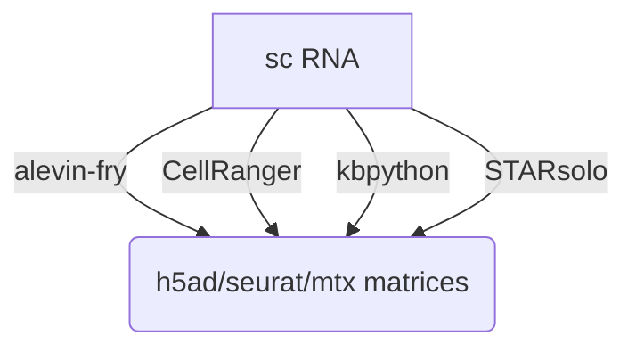

<h1>
  <picture>
    <source media="(prefers-color-scheme: dark)" srcset="docs/images/nf-core-scrnaseq_logo_dark.png">
    
  </picture>
</h1>

[](https://github.com/nf-core/scrnaseq/actions/workflows/ci.yml)
[](https://github.com/nf-core/scrnaseq/actions/workflows/linting.yml)
[](https://nf-co.re/scrnaseq/results)
[](https://doi.org/10.5281/zenodo.3568187)
[](https://www.nf-test.com)

[](https://www.nextflow.io/)
[](https://docs.conda.io/en/latest/)
[](https://www.docker.com/)
[](https://sylabs.io/docs/)
[](https://cloud.seqera.io/launch?pipeline=https://github.com/nf-core/scrnaseq)

[](https://nfcore.slack.com/channels/scrnaseq)[](https://twitter.com/nf_core)[](https://mstdn.science/@nf_core)[](https://www.youtube.com/c/nf-core)

## Introduction

**nf-core/scrnaseq** is a bioinformatics best-practice analysis pipeline for processing 10x Genomics single-cell RNA-seq data.

This is a community effort in building a pipeline capable to support:

- Alevin-Fry + AlevinQC
- STARSolo
- Kallisto + BUStools
- Cellranger

> [!IMPORTANT]
> Cellranger is a commercial tool from 10X Genomics Inc. and falls under the EULA from 10X Genomics Inc. The container provided for the CellRanger functionality in this pipeline has been built by the nf-core community and is therefore _not supported by 10X genomics_ directly. We are in discussions with 10X on how to improve the user experience and licence situation for both us as a community as well as 10X and end users and will update this statement here accordingly.

## Documentation

The nf-core/scrnaseq pipeline comes with documentation about the pipeline [usage](https://nf-co.re/scrnaseq/usage), [parameters](https://nf-co.re/scrnaseq/parameters) and [output](https://nf-co.re/scrnaseq/output).



## Usage

> [!NOTE]
> If you are new to Nextflow and nf-core, please refer to [this page](https://nf-co.re/docs/usage/installation) on how to set-up Nextflow.Make sure to [test your setup](https://nf-co.re/docs/usage/introduction#how-to-run-a-pipeline) with `-profile test` before running the workflow on actual data.

First, prepare a samplesheet with your input data that looks as follows:

`samplesheet.csv`:

```csv
sample,fastq_1,fastq_2,expected_cells
pbmc8k,pbmc8k_S1_L007_R1_001.fastq.gz,pbmc8k_S1_L007_R2_001.fastq.gz,10000
pbmc8k,pbmc8k_S1_L008_R1_001.fastq.gz,pbmc8k_S1_L008_R2_001.fastq.gz,10000
```

Each row represents a fastq file (single-end) or a pair of fastq files (paired end).

Now, you can run the pipeline using:

```bash
nextflow run nf-core/scrnaseq \
   -profile <docker/singularity/.../institute> \
   --input samplesheet.csv \
   --fasta GRCm38.p6.genome.chr19.fa \
   --gtf gencode.vM19.annotation.chr19.gtf \
   --protocol 10XV2 \
   --aligner <alevin/kallisto/star/cellranger> \
   --outdir <OUTDIR>
```

> [!WARNING]
> Please provide pipeline parameters via the CLI or Nextflow `-params-file` option. Custom config files including those provided by the `-c` Nextflow option can be used to provide any configuration _**except for parameters**_; see [docs](https://nf-co.re/docs/usage/getting_started/configuration#custom-configuration-files).

For more details and further functionality, please refer to the [usage documentation](https://nf-co.re/scrnaseq/usage) and the [parameter documentation](https://nf-co.re/scrnaseq/parameters).

## Decision Tree for users

The nf-core/scrnaseq pipeline features several paths to analyze your single cell data. Future additions will also be done soon, e.g. the addition of multi-ome analysis types. To aid users in analyzing their data, we have added a decision tree to help people decide on what type of analysis they want to run and how to choose appropriate parameters for that.



Options for the respective alignment method can be found [here](https://github.com/nf-core/scrnaseq/blob/dev/docs/usage.md#aligning-options) to choose between methods.

## Pipeline output

To see the results of an example test run with a full size dataset refer to the [results](https://nf-co.re/scrnaseq/results) tab on the nf-core website pipeline page.
For more details about the output files and reports, please refer to the
[output documentation](https://nf-co.re/scrnaseq/output).

## Credits

nf-core/scrnaseq was originally written by Bailey PJ, Botvinnik O, Marques de Almeida F, Gabernet G, Peltzer A, Sturm G.

We thank the following people and teams for their extensive assistance in the development of this pipeline:

- @heylf
- @KevinMenden
- @FloWuenne
- @rob-p
- [GHGA](https://www.ghga.de/)

## Contributions and Support

If you would like to contribute to this pipeline, please see the [contributing guidelines](.github/CONTRIBUTING.md).

For further information or help, don't hesitate to get in touch on the [Slack `#scrnaseq` channel](https://nfcore.slack.com/channels/scrnaseq) (you can join with [this invite](https://nf-co.re/join/slack)).

## Citations

If you use nf-core/scrnaseq for your analysis, please cite it using the following doi: [10.5281/zenodo.3568187](https://doi.org/10.5281/zenodo.3568187)

The basic benchmarks that were used as motivation for incorporating the available modular workflows can be found in [this publication](https://www.biorxiv.org/content/10.1101/673285v2).

We offer all three paths for the processing of scRNAseq data so it remains up to the user to decide which pipeline workflow is chosen for a particular analysis question.

An extensive list of references for the tools used by the pipeline can be found in the [`CITATIONS.md`](CITATIONS.md) file.
