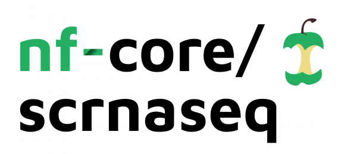

# 

**A fully automated Nextflow pipeline for Droplet-based (e.g. 10x Genomics) single-cell RNA-Seq data**.

[](https://github.com/nf-core/scrnaseq/actions)
[](https://github.com/nf-core/scrnaseq/actions)
[](https://www.nextflow.io/)

[](http://bioconda.github.io/)
[](https://hub.docker.com/r/nfcore/scrnaseq)

[](https://nfcore.slack.com/channels/scrnaseq)

## Introduction

The pipeline is built using [Nextflow](https://www.nextflow.io), a workflow tool to run tasks across multiple compute infrastructures in a very portable manner. It comes with docker containers making installation trivial and results highly reproducible.

Work in progress - this is a community effort in building a pipeline capable to support:

* Alevin + AlevinQC
* STARSolo
* Kallisto + BUStools

## Quick Start

i. Install [`nextflow`](https://nf-co.re/usage/installation)

ii. Install either [`Docker`](https://docs.docker.com/engine/installation/) or [`Singularity`](https://www.sylabs.io/guides/3.0/user-guide/) for full pipeline reproducibility (please only use [`Conda`](https://conda.io/miniconda.html) as a last resort; see [docs](https://nf-co.re/usage/configuration#basic-configuration-profiles))

iii. Download the pipeline and test it on a minimal dataset with a single command

```bash
nextflow run nf-core/scrnaseq -profile test,<docker/singularity/conda/institute>
```

> Please check [nf-core/configs](https://github.com/nf-core/configs#documentation) to see if a custom config file to run nf-core pipelines already exists for your Institute. If so, you can simply use `-profile <institute>` in your command. This will enable either `docker` or `singularity` and set the appropriate execution settings for your local compute environment.

iv. Start running your own analysis!

## Documentation

The nf-core/scrnaseq pipeline comes with documentation about the pipeline, found in the `docs/` directory:

1. [Installation](https://nf-co.re/usage/installation)
2. Pipeline configuration
    * [Local installation](https://nf-co.re/usage/local_installation)
    * [Adding your own system config](https://nf-co.re/usage/adding_own_config)
    * [Reference genomes](https://nf-co.re/usage/reference_genomes)
3. [Running the pipeline](docs/usage.md)
4. [Output and how to interpret the results](docs/output.md)
5. [Troubleshooting](https://nf-co.re/usage/troubleshooting)

## Credits

The `nf-core/scrnaseq` was initiated by [Peter J. Bailey](https://github.com/PeterBailey) (Salmon Alevin, AlevinQC) with major contributions from [Olga Botvinnik](https://github.com/olgabot) (STARsolo, Testdata) and [Alex Peltzer](https://github.com/apeltzer) (Kallisto/BusTools workflow).

## Citation

The basic benchmarks that were used as motivation for incorporating the three available modular workflows can be found in [this publication](https://www.biorxiv.org/content/10.1101/673285v2).

We offer all three paths for the processing of scRNAseq data so it remains up to the user to decide which pipeline workflow is chosen for a particular analysis question.

You can cite the `nf-core` publication as follows:

> **The nf-core framework for community-curated bioinformatics pipelines.**
>
> Philip Ewels, Alexander Peltzer, Sven Fillinger, Harshil Patel, Johannes Alneberg, Andreas Wilm, Maxime Ulysse Garcia, Paolo Di Tommaso & Sven Nahnsen.
>
> _Nat Biotechnol._ 2020 Feb 13. doi: [10.1038/s41587-020-0439-x](https://dx.doi.org/10.1038/s41587-020-0439-x).  
> ReadCube: [Full Access Link](https://rdcu.be/b1GjZ)
