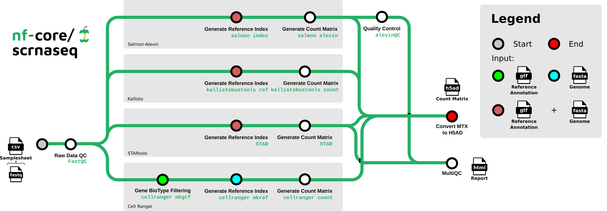

#  

[](https://github.com/nf-core/scrnaseq/actions?query=workflow%3A%22nf-core+CI%22)
[](https://github.com/nf-core/scrnaseq/actions?query=workflow%3A%22nf-core+linting%22)
[](https://nf-co.re/scrnaseq/results)
[](https://doi.org/10.5281/zenodo.3568187)
[](https://doi.org/10.5281/zenodo.6656322)

[](https://www.nextflow.io/)
[](https://docs.conda.io/en/latest/)
[](https://www.docker.com/)
[](https://sylabs.io/docs/)
[](https://tower.nf/launch?pipeline=https://github.com/nf-core/scrnaseq)

[](https://nfcore.slack.com/channels/scrnaseq)[](https://twitter.com/nf_core)[](https://www.youtube.com/c/nf-core)

## Introduction

**nf-core/scrnaseq** is a bioinformatics best-practice analysis pipeline for processing 10x Genomics single-cell RNA-seq data.

The pipeline is built using [Nextflow](https://www.nextflow.io), a workflow tool to run tasks across multiple compute infrastructures in a very portable manner. It uses Docker/Singularity containers making installation trivial and results highly reproducible. The [Nextflow DSL2](https://www.nextflow.io/docs/latest/dsl2.html) implementation of this pipeline uses one container per process which makes it much easier to maintain and update software dependencies. Where possible, these processes have been submitted to and installed from [nf-core/modules](https://github.com/nf-core/modules) in order to make them available to all nf-core pipelines, and to everyone within the Nextflow community!

On release, automated continuous integration tests run the pipeline on a full-sized dataset on the AWS cloud infrastructure. This ensures that the pipeline runs on AWS, has sensible resource allocation defaults set to run on real-world datasets, and permits the persistent storage of results to benchmark between pipeline releases and other analysis sources. The results obtained from the full-sized test can be viewed on the [nf-core website](https://nf-co.re/scrnaseq/results).

This is a community effort in building a pipeline capable to support:

- Alevin-Fry + AlevinQC
- STARSolo
- Kallisto + BUStools
- Cellranger

## Documentation

The nf-core/scrnaseq pipeline comes with documentation about the pipeline [usage](https://nf-co.re/scrnaseq/usage), [parameters](https://nf-co.re/scrnaseq/parameters) and [output](https://nf-co.re/scrnaseq/output).



## Quick Start

1. Install [`Nextflow`](https://www.nextflow.io/docs/latest/getstarted.html#installation) (`>=21.10.3`)

2. Install any of [`Docker`](https://docs.docker.com/engine/installation/), [`Singularity`](https://www.sylabs.io/guides/3.0/user-guide/) (you can follow [this tutorial](https://singularity-tutorial.github.io/01-installation/)), [`Podman`](https://podman.io/), [`Shifter`](https://nersc.gitlab.io/development/shifter/how-to-use/) or [`Charliecloud`](https://hpc.github.io/charliecloud/) for full pipeline reproducibility _(you can use [`Conda`](https://conda.io/miniconda.html) both to install Nextflow itself and also to manage software within pipelines. Please only use it within pipelines as a last resort; see [docs](https://nf-co.re/usage/configuration#basic-configuration-profiles))_.

3. Download the pipeline and test it on a minimal dataset with a single command:

   ```bash
   nextflow run nf-core/scrnaseq -profile test,YOURPROFILE --outdir <OUTDIR>
   ```

   Note that some form of configuration will be needed so that Nextflow knows how to fetch the required software. This is usually done in the form of a config profile (`YOURPROFILE` in the example command above). You can chain multiple config profiles in a comma-separated string.

   > - The pipeline comes with config profiles called `docker`, `singularity`, `podman`, `shifter`, `charliecloud` and `conda` which instruct the pipeline to use the named tool for software management. For example, `-profile test,docker`.
   > - Please check [nf-core/configs](https://github.com/nf-core/configs#documentation) to see if a custom config file to run nf-core pipelines already exists for your Institute. If so, you can simply use `-profile <institute>` in your command. This will enable either `docker` or `singularity` and set the appropriate execution settings for your local compute environment.
   > - If you are using `singularity`, please use the [`nf-core download`](https://nf-co.re/tools/#downloading-pipelines-for-offline-use) command to download images first, before running the pipeline. Setting the [`NXF_SINGULARITY_CACHEDIR` or `singularity.cacheDir`](https://www.nextflow.io/docs/latest/singularity.html?#singularity-docker-hub) Nextflow options enables you to store and re-use the images from a central location for future pipeline runs.
   > - If you are using `conda`, it is highly recommended to use the [`NXF_CONDA_CACHEDIR` or `conda.cacheDir`](https://www.nextflow.io/docs/latest/conda.html) settings to store the environments in a central location for future pipeline runs.

4. Start running your own analysis!

   ```console
   nextflow run nf-core/scrnaseq --input samplesheet.csv --outdir <OUTDIR> --genome_fasta GRCm38.p6.genome.chr19.fa --gtf gencode.vM19.annotation.chr19.gtf --protocol 10XV2 --aligner <alevin/kallisto/star/cellranger> -profile <docker/singularity/podman/shifter/charliecloud/conda/institute>
   ```

## Decision Tree for users

The nf-core/scrnaseq pipeline features several paths to analyze your single cell data. Future additions will also be done soon, e.g. the addition of multi-ome analysis types. To aid users in analyzing their data, we have added a decision tree to help people decide on what type of analysis they want to run and how to choose appropriate parameters for that.


Options for the respective alignment method can be found [here](https://github.com/nf-core/scrnaseq/blob/dev/docs/usage.md#aligning-options) to choose between methods.

## Credits

nf-core/scrnaseq was originally written by Bailey PJ, Botvinnik O, Marques de Almeida F, Gabernet G, Peltzer A, Sturm G.

We thank the following people for their extensive assistance in the development of this pipeline:

- @heylf
- @KevinMenden
- @FloWuenne
- @rob-p

## Contributions and Support

If you would like to contribute to this pipeline, please see the [contributing guidelines](.github/CONTRIBUTING.md).

For further information or help, don't hesitate to get in touch on the [Slack `#scrnaseq` channel](https://nfcore.slack.com/channels/scrnaseq) (you can join with [this invite](https://nf-co.re/join/slack)).

## Citations

If you use nf-core/scrnaseq for your analysis, please cite it using the following doi: [10.5281/zenodo.3568187](https://doi.org/10.5281/zenodo.3568187)

The basic benchmarks that were used as motivation for incorporating the three available modular workflows can be found in [this publication](https://www.biorxiv.org/content/10.1101/673285v2).

We offer all three paths for the processing of scRNAseq data so it remains up to the user to decide which pipeline workflow is chosen for a particular analysis question.

An extensive list of references for the tools used by the pipeline can be found in the [`CITATIONS.md`](CITATIONS.md) file.
